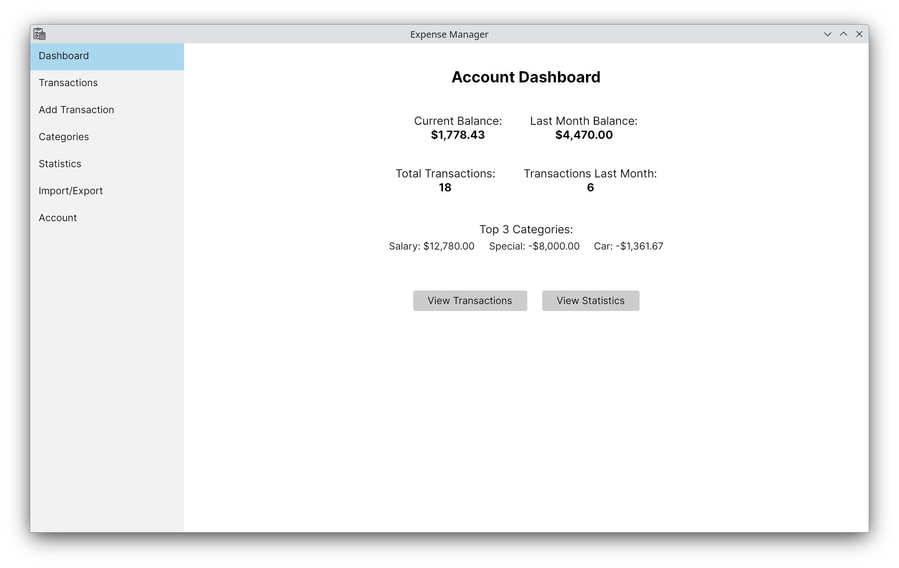
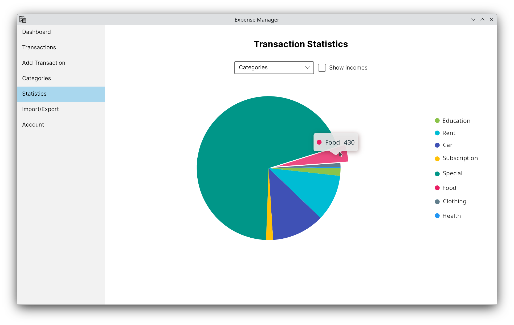
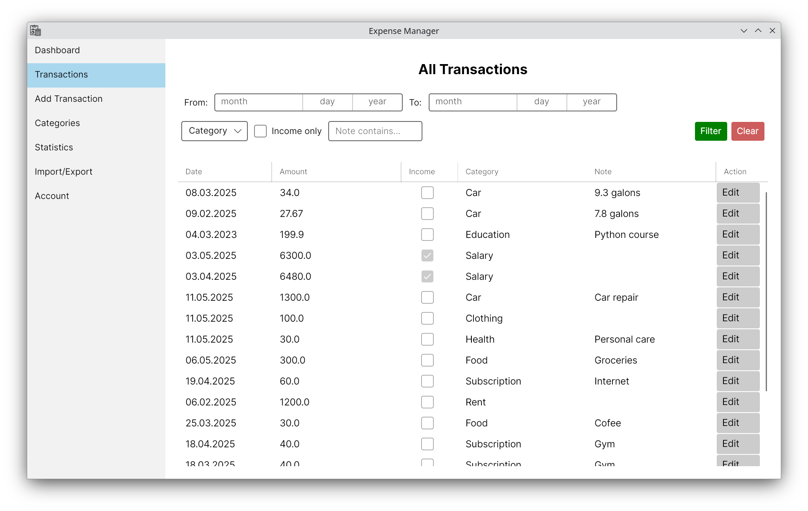

# Expense Manager

## About

Expense Manager is a simple desktop application for personal finance management. It allows users to track their income and expenses, organize them into categories, filter transactions based on various criteria, monitor their account balance, and view basic financial statistics. The application is built using Avalonia with an SQLite database and follows the MVVM architecture pattern.

## Features

- User registration and secure login with password hashing
- Add, edit, and delete income and expense transactions
- Categorize transactions using predefined and custom categories
- View current account balance with income and expense summaries
- Filter (and order) transactions by date range, category, type, and notes
- Manage categories: add new ones and delete unused categories
- Import and export transaction data asynchronously to JSON
- Display various financial statistics as graphs

## Preview

Here are some screenshots showcasing the app’s interface and main features:





More screenshots [here](screenshots).

## Setup and Installation

To run the application locally:

1. Clone the repository:
    ```
    git clone https://github.com/martincimbal/expense-manager.git
    ```
2. Make sure .NET 8 SDK is installed.

3. Navigate to the project directory (paths shown here are for Unix-like systems; on Windows adjust accordingly):
    ```
    cd expense-manager/expense-manager-30/expense-manager-30
    ```

4. Restore dependencies:
    ```
    dotnet restore
    ```

5. Run the application:
    ```
    dotnet run
    ```

The app will start as a desktop window using Avalonia.

## Technologies Used


- **C#** – Main language for application logic.
- **.NET 8** – Target framework providing runtime and base libraries.
- **Avalonia UI** (11.2.7) – Cross-platform UI framework used for building the desktop interface.
- **SQLite** (System.Data.SQLite 1.0.119) – Local database engine for storing transactions, categories and user data.
- **CommunityToolkit.Mvvm** (8.2.1) – MVVM helper library for clean separation of UI and business logic.
- **LiveChartsCore.SkiaSharpView.Avalonia** (2.0.0-rc5.4) – Charting library for displaying financial graphs and statistics.

## License

This project is licensed under the [MIT License](LICENSE).